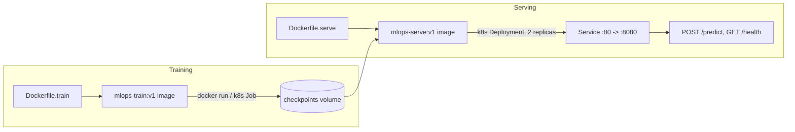

# mlops-pytorch-pipeline
MLOps Assignment 3: Deploying PyTorch ML Workloads with Docker & Kubernetes
Roll no: DA25M597
Name: Niha Bai N

- [x] Part A: Repository Setup
- [x] Part B: PyTorch Model
- [x] Part C: Docker Containerization
- [x] Part D: Kubernetes Training Job
- [ ] Part E: Kubernetes Model Serving
- [ ] Part F: End-to-End Validation
> Work in progress

## Overview
- **Dataset:** Fashion MNIST (10 classes)
- **Architecture:** ResNet-18 (pretrained, stem adapted for greyscale 28x28 input)
- **Training:** Configurable via 'configs/training_config.yaml'
- **Servicing:** FastAPI app 'src/serve.py' exposing 'POST /predict' and 'GET /health'

## Architecture diagram

## Set up instructions (Kubernetes deployment)
**Prerequisites:** a local cluster (Docker Desktop's built-in Kubernetes, or an equivalent), `kubectl`

```bash
# Namespace, config, and training job
kubectl apply -f k8s/namespace.yaml
kubectl apply -f k8s/configmap.yaml
kubectl apply -f k8s/training-job.yaml

# Check training progress
kubectl get pods -n ml-training
kubectl logs -f job/training-job -n ml-training

# Once training completes, deploy serving
kubectl apply -f k8s/serving-deployment.yaml
kubectl apply -f k8s/serving-service.yaml
kubectl apply -f k8s/hpa.yaml

# Verify and test
kubectl get pods -n ml-training
kubectl port-forward svc/model-serving 8080:80 -n ml-training
curl -X POST http://localhost:8080/predict -F "image=@test_image.png"
```
Verified: 10-epoch training run reaches ~93.95% validation accuracy, serving container correctly classifies test images via `/predict`.

## Set up instructions (local deployment)
**Prerequisites:** Docker Desktop

```bash
# Build training image
docker build -f docker/Dockerfile.train -t mlops-train:v1 .

# Run training (mounts local data/ and checkpoints/ folders)
docker run --rm -v %cd%\data:/app/data -v %cd%\checkpoints:/app/checkpoints mlops-train:v1

# Build serving image
docker build -f docker/Dockerfile.serve -t mlops-serve:v1 .

# Run serving
docker run --rm -p 8080:8080 -v %cd%\checkpoints:/app/checkpoints mlops-serve:v1

# Test prediction endpoint
curl -X POST http://localhost:8080/predict -F "image=@test_image.png"
```
Verified locally: 10-epoch training run reaches ~93.6% validation accuracy, serving container correctly classifies test images via `/predict`.

## Repository structure
```
|--.github\workflows\ci.yml
|--configs
|--|_training_config.yaml       # hyperparameters, dataset, checkpoint paths
|--docker
|--|--Dockerfile.serve          # multi-stage image for FastAPI serving
|--|__Dockerfile.train          # multi-stage image for training
|--k8s
|--|--configmap.yaml            # training_config.yaml mounted into the training 
|--|--hpa.yaml
|--|--namespace.yaml            # creates the ml-training namespace
|--|--serving-deployment.yaml   # 2-replica FastAPI serving Deployment
|--|__training-job.yaml         # training Job + PVCs for /app/data and /app/checkpoints
|--requirements
|--|--serve.txt
|--|__train.txt
|--src
|--|--dataset.py
|--|--model.py
|--|--serve.py
|--|__train.py
|--tests
|--|__test_model.py
|--.dockerignore
|--.gitignore
|_ README.md
```
**Note:** `data/` and `checkpoints/` are not committed to git (see `.gitignore`) — they're created automatically when you run the Docker/Kubernetes commands above. `data/` holds the downloaded Fashion-MNIST dataset, `checkpoints/` holds the trained model weights (`FashionMnistClassifier.pt`).